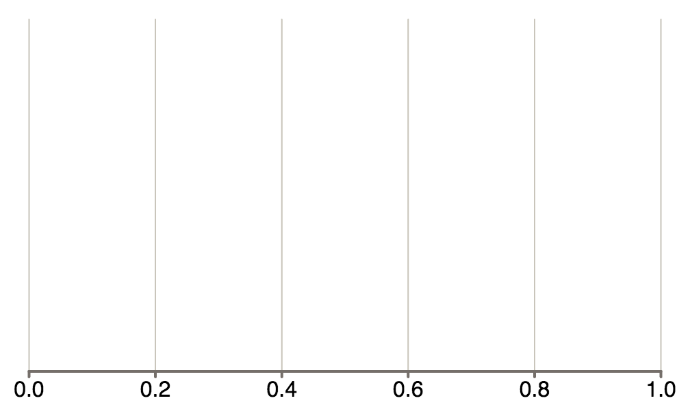
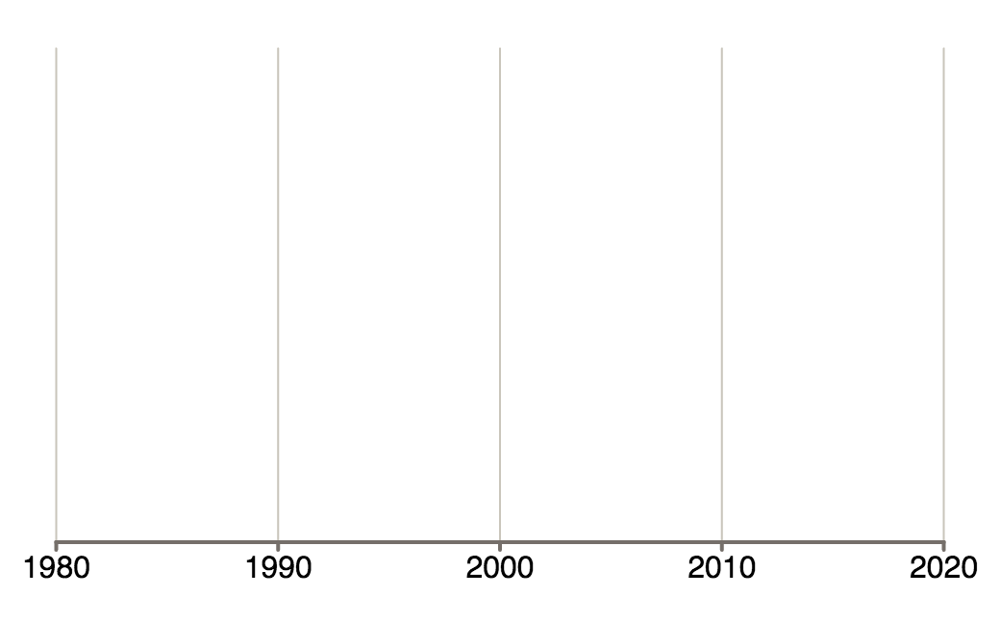

[![Travis Status][trav_img]][trav_site]

Victory Axis
=============

Victory axis is an implementation of d3 axis that leaves all of the rendering to React. In addition to the usual d3 features, Victory Axis comes with some default styling, and will also nicely center your axis given a height and width.

## Examples

Victory Axis is written to be highly configurable, but it also includes a set of sensible defaults and fallbacks. If no properties are provided,   

```
 <svg width={500} height={500}>
    <VictoryAxis/>
  </svg>
```

Victory Axis renders the following default axis:



Axes are meant to be composble. Axes with the same offsets should line up automatically.  
```
<svg width={500} height={500}>
  <VictoryAxis
    label="x-axis"
    orientation="bottom"
    offsetX={50}
    offsetY={50}/>
  <VictoryAxis
    label="y-axis"
    orientation="left"
    offsetX={50}
    offsetY={50}/>
</svg>
```

Labels are automatically centered along each axis.


With a little more code, you can make a time scale with custom tick values and formatting. 

```
<svg width={500} height={500}>
  <VictoryAxis
    scale={() => d3.time.scale()}
    tickValues={[
      new Date(1980, 1, 1),
      new Date(1990, 1, 1),
      new Date(2000, 1, 1),
      new Date(2010, 1, 1),
      new Date(2020, 1, 1)]}
      tickFormat={() => d3.time.format("%Y")}/>
</svg>
```



~~All~~ Most* other d3 scales are supported too. Here's how you make a log scale:
```
<svg width={500} height={500}>
  <VictoryAxis
    <VictoryAxis style={style.axis}
      orientation="left"
      scale={() => d3.scale.log()}
      offsetX={75}
      domain={[1, 5]}/>/>
</svg>
```


*We're still working on ordinal scales

## API

There a tons of configuration options for Victory Axis. Some map directly to d3, but we've added some new ones too.

### Props

All props are optional for linear scales, but some of the more exotic scales require explicit directions.  Victory Axis will warn you when you encounter one of these prima donnas. Required props for each scale are also enumerated at the end of this section.

#### scale
This prop determines what scale your axis should use. This prop should return a function. Most d3 scale functions are supported.
**Default** scale: `() => d3.scale.linear()`
**PropType** func

#### domain
This prop describes range of input values the axis will cover. This prop should be given as an array of the minimum and maximum expected value for your axis.If this prop isn't provided Victory Axis will try to assign a domain based on `tickValues`, or the default domain of the axis scale  Most d3 scales have default domains of `[0, 1]`. Ordinal, threshold, and quantile scales need a specified domain or `tickValues`.  The default `d3.time.scale` domain will render an axis spanning from 4PM to .001. That probably isn't what you want either.
**Default** calculated
**PropType** array

#### range

**Default** calculated
**PropType** array

#### width 
The maximum width the axis can take up in number of pixels.  This should be equal to or less than the width of the containing svg.  
**Default** width: 500
**PropType** number

#### height 
The maximum height the axis can take up in number of pixels.  This should be equal to or less than the height of the containing svg.  
**Default** height: 300
**PropType** number

#### label 
That's your axis label. 
**Default** label: ""
**PropType** string

#### orientation 
This props describes how the axis will be positioned. Supported options are "top", "bottom", "left", and "right".
**Default** orientation: "bottom"
**PropType** "top", "bottom", "left", "right"

#### offsetX
This value describes how far from the "edge" of it's permitted area each axis will be set back in the x-direction.  If this prop is not given, the offset is calculated based on font size, axis orientation, and label padding.
**Default** calculated
**PropType** number

#### offsetY
This value describes how far from the "edge" of it's permitted area each axis will be set back in the y-direction.  If this prop is not given, the offset is calculated based on font size, axis orientation, and label padding.
**Default** calculated
**PropType** number

#### labelPadding
This value is how much padding your label should get. If Victory Axis has a label, and this value is not provided, label padding will be calculated based on font size. 
**Default** calculated
**PropType** number

style
domain
range
scale
tickCount
tickValues
tickSize
tickPadding
tickFormat

## Development

Please see [DEVELOPMENT](DEVELOPMENT.md)

## Contributing

Please see [CONTRIBUTING](CONTRIBUTING.md)

[trav_img]: https://api.travis-ci.org/FormidableLabs/victory-axis.svg
[trav_site]: https://travis-ci.org/FormidableLabs/victory-axis

