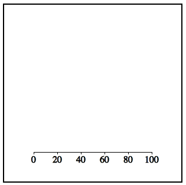
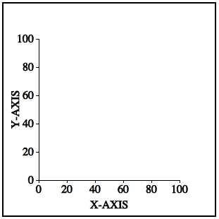
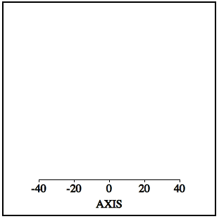

[![Travis Status][trav_img]][trav_site]

Victory Axis
=============

WORK IN PROGRESS

This component draws single axes that can be composed.  Not yet implemented, axes that cross at the origin.  Net yet tested, non-linear axis scales.
Needs a lot of style love!

```
 <svg style={style.svg}>
    < VictoryAxis style={style.axis}/>
  </svg>
```



```
<svg style={style.svg}>
  <VictoryAxis style={style.axis}
    label="X-AXIS"
    orientation="bottom"
    tickValues={[0, 20, 40, 60, 80, 100]}/>
  <VictoryAxis style={style.axis}
    label="Y-AXIS"
    orientation="left"
    tickValues={[0, 20, 40, 60, 80, 100]}/>
</svg>
```



```
<svg style={style.svg}>
  <VictoryAxis style={style.axis}
    label="AXIS"
    tickValues={[-40, -20, 0, 20, 40]}/>
</svg>
```



## Development

Please see [DEVELOPMENT](DEVELOPMENT.md)

## Contributing

Please see [CONTRIBUTING](CONTRIBUTING.md)

[trav_img]: https://api.travis-ci.org/FormidableLabs/victory-axis.svg
[trav_site]: https://travis-ci.org/FormidableLabs/victory-axis

